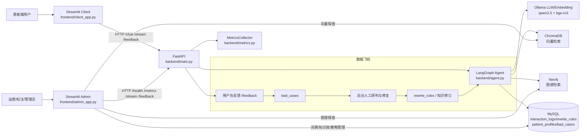

# 医疗问答系统总体架构图

```mermaid
flowchart LR
    U1[患者端用户] --> C1[Streamlit Client<br/>frontend/client_app.py]
    U2[运营/标注/管理员] --> C2[Streamlit Admin<br/>frontend/admin_app.py]

    C1 -->|HTTP /chat /stream /feedback| API[FastAPI<br/>backend/main.py]
    C2 -->|HTTP /health /metrics /stream /feedback| API

    API --> AG[LangGraph Agent<br/>backend/agent.py]
    API --> MET[MetricsCollector<br/>backend/metrics.py]

    AG --> LLM[Ollama LLM/Embedding<br/>qwen2.5 + bge-m3]
    AG --> VDB[ChromaDB<br/>向量检索]
    AG --> GDB[Neo4j<br/>图谱检索]
    AG --> RDB[(MySQL<br/>interaction_logs/rewrite_rules<br/>patient_profiles/bad_cases)]

    C2 -->|词典/知识库/策略管理| RDB
    C2 -->|向量探查| VDB
    C2 -->|图谱探查| GDB

    subgraph DataFlywheel[数据飞轮]
      FB[用户负反馈 /feedback] --> BC[bad_cases]
      BC --> OP[后台人工研判与修复]
      OP --> RW[rewrite_rules / 知识修订]
      RW --> AG
    end

    API --> FB
```
