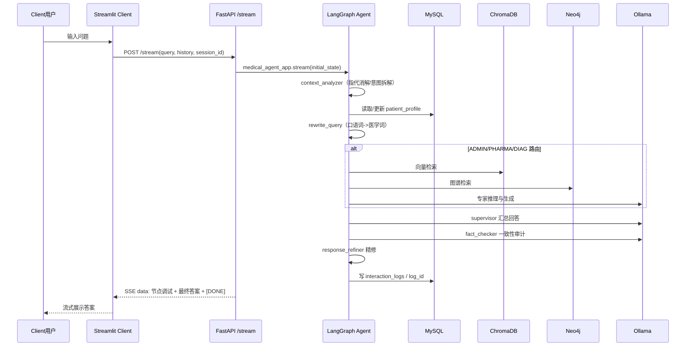

# 核心请求链路时序图（/stream）

```mermaid
sequenceDiagram
    participant User as Client用户
    participant SC as Streamlit Client
    participant API as FastAPI /stream
    participant LG as LangGraph Agent
    participant DB as MySQL
    participant VS as ChromaDB
    participant GS as Neo4j
    participant LLM as Ollama

    User->>SC: 输入问题
    SC->>API: POST /stream(query, history, session_id)
    API->>LG: medical_agent_app.stream(initial_state)

    LG->>LG: context_analyzer（指代消解/意图拆解）
    LG->>DB: 读取/更新 patient_profile
    LG->>LG: rewrite_query（口语词->医学词）

    alt ADMIN/PHARMA/DIAG 路由
        LG->>VS: 向量检索
        LG->>GS: 图谱检索
        LG->>LLM: 专家推理与生成
    end

    LG->>LLM: supervisor 汇总回答
    LG->>LLM: fact_checker 一致性审计
    LG->>LG: response_refiner 精修
    LG->>DB: 写 interaction_logs / log_id

    API-->>SC: SSE data: 节点调试 + 最终答案 + [DONE]
    SC-->>User: 流式展示答案
```
