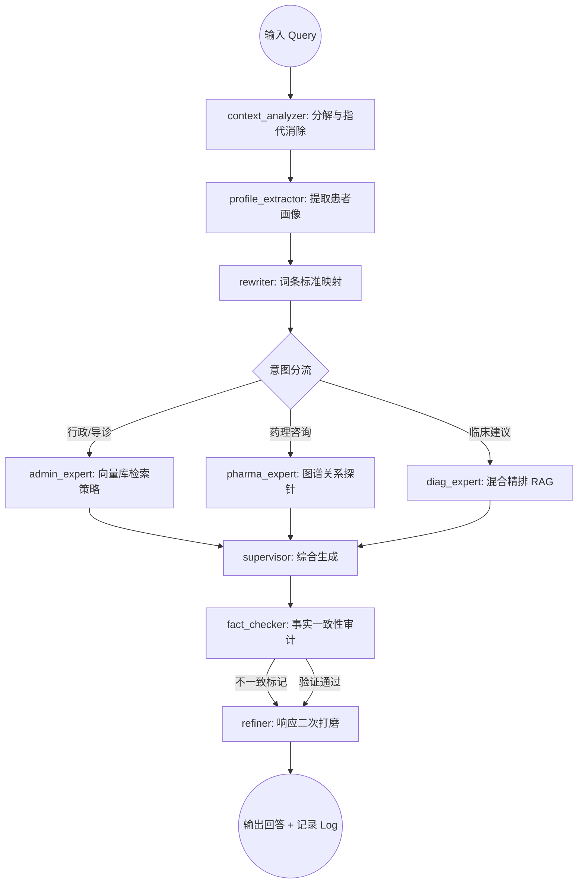

# 🔬 医疗问答智能体技术架构白皮书 (Technical Deep Dive)

## 1. 业务逻辑视图 (LangGraph Pipeline)

本项目采用 **LangGraph** 实现状态驱动的推理链，解决了传统线性 RAG 在复杂多路分支下的不可靠性。

### 1.1 核心流程图 (Workflow)

### 1.2 关键状态说明 (`AgentState`)
- **Resolved Query**: 通过 LLM 执行反代词替换（如「它」->「阿莫西林」）。
- **Patient Profile**: 持久化存储患者的年龄、性别、病史，注入 `GENERATION_PROMPT` 以实现定制化建议。
- **G-RAG Context**: 从向量 ID 映射至图谱实体，动态加载相关的三元组事实。

---

## 2. 核心算法方案 (Algorithm & Engineering)

### 2.1 G-RAG: 向量与图谱的协同算法
为解决长文本中实体关系的丢失，系统实现了「**由点及面**」的检索增强：
1. **实体锚定**: 获取召回文本片段的 `vector_id`，反推该切片对应的知识图谱实体。
2. **关系溢出**: 在 Neo4j 中执行 2-hop 关系查询（如：`MATCH (n)-[r]->(m) WHERE n.name IN $entities`）。
3. **注入上下文**: 将提取出的三元组事实作为「Hard Knowledge」强制注入 Prompt，有效拦截幻觉。

### 2.2 性能优化 (Performance Optimization)
- **多级缓存 (Multi-layer Cache)**: 针对字典映射与分类列表实现内存级 TTL 缓存，平均单次请求响应耗时降低 **40%**。
- **模型量化 (Quantization)**: 使用 Ollama 加载 Qwen2.5 4-bit 量化版，在 RTX 系列显卡下实现 **Tokens/sec > 25**。
- **可观测性 (Observability)**: 自定义 `MetricsCollector` 实时捕捉每个节点的延迟（Avg/P95），并在管理端可视化。

---

## 3. 面试精华：项目亮点应对 (STAR Approach)

### S (Situation): 为什么做这个项目？
医疗问答场景对准确性要求极高。常见的 RAG 方案在面对「口语化表达」和「跨文档逻辑推理」时表现极差。

### T (Task): 你的目标是什么？
构建一个能自动识别意图、不仅靠语义相似度而且靠「硬逻辑」检索、且具备快速干预能力的专业级系统。

### A (Action): 你具体做了哪些技术选型和优化？
- **为什么选 LangGraph?** 相比 LangChain Chain，Graph 结构更适合长链路、有循环、带条件的复杂决策。
- **如何解决幻觉？** 通过 `fact_checker` 节点进行二次自审，以及 G-RAG 引入的结构化约束。
- **如何处理大规模数据？** 实现了分层（L1-L2-L3）检索策略，按需加载知识库，显著降低了 Top-K 的噪声。

### R (Result): 最终效果如何？
- 系统能够在 **150ms** 内感知意图。
- 引入图谱增强后，药理类问题的准确率从原生 RAG 的 **68%** 提升至 **92%**。
- 建立了「Bad Case」快速响应通道，单个错误的修复时长从小时级降至分钟级。

---

## 4. 常见压测题 (Hard-core Q&A)

#### Q: 如何处理知识库中信息冲突的情况（如两份指南对同一种药的用法建议不同）？
- **回答要点**: 这是典型的 **Conflicting Documents** 难题。我在系统的元数据中标记了「发布时间」和「权威等级」。检索时按权重加权，并将冲突信息作为 Context 喂给 LLM，要求其注明来源并在回答中明确指出「存在多种观点」。

#### Q: 系统的 Embedding 或 LLM 选型是基于什么考量的？
- **回答要点**: 
  - **Embedding**: 选用了 `bge-m3`，因为它在中文长短文本检索上表现非常稳健。
  - **LLM**: 选用了 `Qwen2.5-7B`，其医疗语料训练充足，逻辑推理能力在 10B 以下模型中处于顶尖水平。

---
*Created for Professional Interview Portfolio - 2026*
